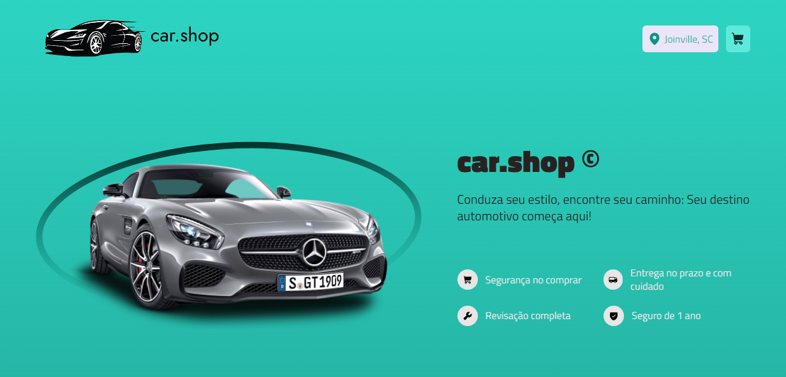
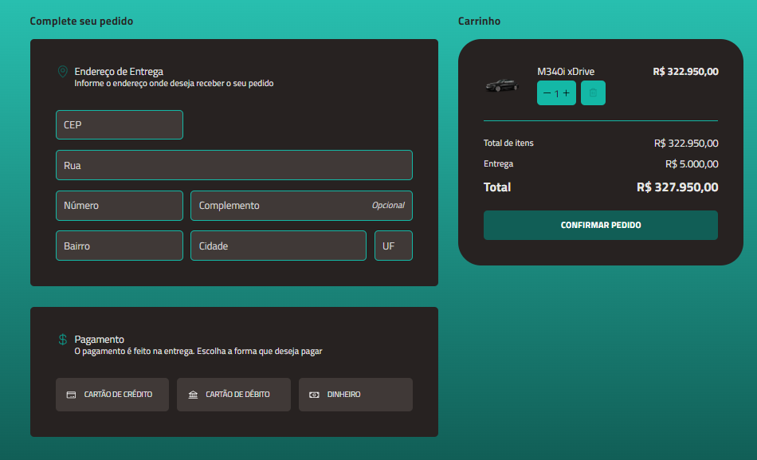

# car.shop | E-commerce

O car.shop é uma loja virtual especializada em vendas de carros novos, tendo o cuidado e excelência.


## Funcionalidades

- Filtagem por Marca, Modelo, Ano, Preço e Combustivel.
- Preview em tempo real.
- Carrinho com formulario.
- LocalStorage.
- Total de preços.
- Quantidade de produtos no carrinho.


## Stack utilizada Dependentes

**Front-end:** 
- React 18
- TypeScript
- Styled-Components 
- Phosphor Icons
- React Hook Form
- React Router DOM
- Zod
- React Helmet Async


## Demonstração

Vialização de Demonstração do projeto [ACESSE AQUI!](https://car-shop-almirjrdev.vercel.app/) 💻


## Rodando localmente

Clone o projeto

```bash
  git clone https://github.com/AlmirJrDev/car.shop.git
```

Entre no diretório do projeto

```bash
  cd car.shop
```

Instale as dependências

```bash
  npm install
```

Inicie o projeto

```bash
  npm run dev
```


## Screenshots







